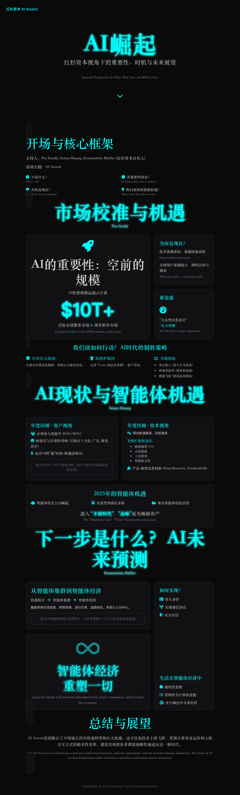

# Sequoia's Perspective on the AI Ascent: So What, Why Now, and What's Next
# 红杉资本视角下的AI崛起：重要性、时机与未来展望

---

## 引言 (Introduction)
**主持人 (Hosts):** Pat Grady, Sonya Huang, Konstantine Buhler (Sequoia Partners)
**活动主题 (Event Theme):** AI Ascent

---

## 核心框架 (Core Framework)
- **What is AI? (AI 是什么？)**
- **So What? (Why does it matter?) (其重要性何在？)**
- **Why Now? (Is it imminent?) (为何是现在？)**
- **What Now? (How do we win?) (我们该如何把握机遇？)**

---

## 第一部分：Pat Grady - 市场校准与机遇 (Part 1: Pat Grady - Market Calibration & Opportunity)
### AI的重要性：空前的规模 ("So What?" - AI's Unprecedented Scale)
**对比云计算 (Comparison with Cloud):**
- EN: The AI transition is an order of magnitude larger than the cloud transition.
- CN: AI 转型比云计算转型规模大一个数量级。
- EN: Cloud market (initial): $350B software base -> $400B cloud revenue today.
- CN: 云计算市场（初期）：3500万美元的软件基础 -> 如今4000万美元的云计算收入。
- EN: AI market (initial): Targets $10T global services market AND the existing software market.
- CN: AI 市场（初期）：目标是10万亿美元的服务市场 以及 现有的软件市场。

**关键更新 (Key Update):**
- EN: AI impacts both services AND software profit pools.
- CN: AI 同时冲击服务业和软件业的利润池。

### 为何是现在？加速的采纳 ("Why Now?" - The Acceleration of Adoption)
**技术浪潮的叠加性 (Additive Nature of Tech Waves):**
- EN: Technology waves (Semiconductors -> Systems -> Networks -> Internet -> Apps -> Mobile -> AI) build on previous infrastructure.
- CN: 技术浪潮（半导体 -> 系统 -> 网络 -> 互联网 -> 应用 -> 移动 -> AI）是层层叠加、建立在先前基础设施之上的。

**AI采纳加速的原因 (Reasons for Accelerated AI Adoption):**
1. EN: Established digital infrastructure (compute, networks, data, distribution, talent).
   CN: 已建立的数字基础设施（计算、网络、数据、分发渠道、人才）。
2. EN: Pre-existing global user base (e.g., 1.8B users on Reddit/X, 5.6B internet users).
   CN: 已有的庞大全球用户基础（例如 Reddit/X 上的18亿用户，56亿互联网用户）。
3. EN: Instant global awareness and desire (e.g., ChatGPT launch).
   CN: 即时的全球认知度和用户渴望（例如 ChatGPT 的发布）。

**比喻 (Metaphor):**
- EN: The "rails are in place," and with the "starting gun" fired, there are minimal barriers to adoption. The physics of distribution have changed.
- CN: “铁轨已铺设完毕”，“发令枪已响”，采纳的障碍极小。分销的物理规则已经改变。

### 我们该如何行动？AI时代的制胜策略 ("What Now?" - Strategies for Winning in AI)
**应用层是主战场 (The Application Layer is the Battleground):**
- EN: Most value will be captured at the application layer. Startups must differentiate here.
- CN: 大部分价值将在应用层被捕获。初创公司必须在此实现差异化。

**构建护城河 (Building Moats):**
- EN: Utilize the "Leone Merchandising Cycle" (Vision -> Product -> Engineering -> Marketing -> Sales -> Support).
- CN: 运用“Leone 商品化周期”（愿景 -> 产品 -> 工程 -> 市场 -> 销售 -> 支持）。
- EN: Adopt a customer-back approach (solve specific problems) rather than just tech-out.
- CN: 采取客户导向（解决特定问题）而非仅技术驱动的方法。

**AI公司的关键指标 (Key AI Company Metrics):**
1. EN: Revenue: Ensure it's 'real revenue' (creating durable behavior change) not just 'vibe revenue'. Customer trust is paramount.
   CN: 收入： 确保是“真实收入”（创造持久的行为改变）而非仅“氛围收入”。客户信任至关重要。
2. EN: Margins: Focus on the slope of gross margin improvement (price vs. COGS) over time, not just the initial intercept.
   CN: 利润率： 关注毛利率随时间改善的斜率（价格 vs. 销货成本），而非初始的截距。
3. EN: Data Flywheel: It must demonstrably improve a core business metric. If not, it's "bullshit."
   CN: 数据飞轮： 必须能显著改善核心业务指标。否则就是“扯淡”。

**紧迫感 (Urgency):**
- EN: "Nature abhors a vacuum." The market demand for AI solutions is immense. "Run like heck" to capture the opportunity.
- CN: “大自然厌恶真空”。市场对 AI 解决方案的需求巨大。“全力奔跑”以抓住机遇。

---

## 第二部分：Sonya Huang - AI现状：年度回顾与智能体机遇 (Part 2: Sonya Huang - AI Now: Year in Review & Agent Opportunity)
### 年度回顾 - 客户视角 (Year in Review - Customer-Back Perspective)
**应用参与度提升 (Improving App Engagement):**
- EN: Daily Active Users / Monthly Active Users (DAU/MAU) for AI-native apps like ChatGPT are significantly improving, climbing towards Reddit levels.
- CN: 像 ChatGPT 这样的 AI 原生应用的日活跃用户/月活跃用户（DAU/MAU）比例显著提高，正在接近 Reddit 等成熟平台的水平。

**病毒式与实用性用例 (Viral & Practical Use Cases):**
- EN: Fun applications (e.g., "Ghiblify" everything) show user enthusiasm.
- CN: 有趣的娱乐性应用（如将万物“吉卜力化”）展示了用户热情。
- EN: AI is making inroads in advertising (ad copy), education (visualizing concepts), and healthcare (OpenEvidence for diagnostics).
- CN: AI 也在广告（广告文案）、教育（概念可视化）和医疗保健（OpenEvidence 用于诊断）领域取得进展。

**语音AI的“她”时刻 (Voice AI's "Her Moment"):**
- EN: Voice generation technology (e.g., Rabbit R1 demo) is rapidly crossing the uncanny valley, becoming incredibly realistic, reminiscent of the movie "Her."
- CN: 语音生成技术（例如 Rabbit R1 演示）正迅速跨越恐怖谷，变得异常逼真，让人联想到电影《她》(Her)。

### 年度回顾 - 技术视角 (Year in Review - Technology-Out Perspective)
**预训练的局限性 (Pre-training Limits):**
- EN: The massive scaling of pre-training (9-10 orders of magnitude since AlexNet) suggests diminishing returns from simply adding more data/compute. Low-hanging fruit has been picked.
- CN: 自 AlexNet 以来，预训练规模已扩大 9-10 个数量级，这表明仅仅增加数据/算力带来的回报正在减少。低垂的果实已被摘取。

**智能扩展的新途径 (New Vectors for Intelligence):**
- EN: Progress is now driven by: Reasoning Models (e.g., OpenAI's O3), Synthetic Data, Tool Use, Agentic Scaffolding.
- CN: 目前的进展更多由以下因素驱动：推理模型（例如 OpenAI 的 O3）、合成数据、工具使用、智能体支架（Agentic Scaffolding）。

**产品-模型边界的创新 (Product-Model Boundary Innovation):**
- EN: Products like OpenAI's Deep Research and Google's NotebookLM showcase innovation at the intersection of model capabilities and user-facing products.
- CN: 像 OpenAI 的 Deep Research 和 Google 的 NotebookLM 这样的产品展示了在模型能力和面向用户的产品交叉点上的创新。

### 2025年的智能体机遇 (The Agent Opportunity in 2025)
**智能体优先公司的崛起 (Rise of Agent-First Companies):**
- EN: Expect a surge in companies built around AI agents.
- CN: 预计将涌现大量以 AI 智能体为核心的公司。

**从原型到强化系统 (From Prototypes to Hardened Systems):**
- EN: Agents will evolve from simple prototypes to robust, reliable systems through: 1. Sophisticated orchestration with rigorous testing and evaluation. 2. End-to-end fine-tuned agent training.
- CN: 智能体将从简单的原型进化为强大可靠的系统，途径包括：1. 带有严格测试和评估的复杂编排。2. 端到端微调的智能体训练。

**垂直智能体 (Vertical Agents):**
- EN: These will thrive by offering deep tech solutions tailored to specific industry needs, creating significant customer value (e.g., Xbow in cybersecurity, Traversal in DevOps, Meter in networking).
- CN: 通过在特定领域提供更深层次的技术解决方案和客户价值而蓬勃发展（例如，网络安全领域的 Xbow，DevOps 领域的 Traversal，网络领域的 Meter）。

**丰裕时代 (The Abundance Era):**
- EN: With AI-driven code generation (the first market to "tip"), labor becomes cheap and plentiful. Consequently, "taste" and unique human insight will become the scarce, valuable assets.
- CN: 随着 AI 驱动的代码生成（首个“引爆”的市场类别），劳动力变得廉价且充足。因此，“品味”和独特的人类洞察力将成为稀缺且有价值的资产。

---

## 第三部分：Konstantine Buhler - 下一步是什么？AI未来的预测 (Part 3: Konstantine Buhler - What's Next? Predictions for the AI Future)
### 从智能体集群到智能体经济 (From Agent Swarms to Agent Economy)
- EN: Machine assistants will evolve into interconnected "Agent Swarms."
- CN: 机器助手将发展成为相互连接的“智能体集群”。
- EN: These will mature into a full-fledged "Agent Economy" where agents communicate information, transfer resources, make transactions, and track each other's trust/reliability.
- CN: 这些集群将成熟为成熟的“智能体经济”，在其中智能体不仅交流信息，还会转移资源、进行交易，并追踪彼此的信任度和可靠性。
- EN: This system will be human-centric, with agents augmenting human capabilities.
- CN: 这个系统将以人为中心，智能体增强人类的能力。

### 如何实现 - 关键技术推动因素 (How We Get There - Key Technical Enablers)
1. EN: Persistent Identity: Agents require stable, verifiable identities for interaction and trust.
   CN: 持久身份： 智能体需要稳定、可验证的身份以进行交互和建立信任。
2. EN: Seamless Communication Protocols: Standardized protocols for agent-to-agent interaction are essential (akin to TCP/IP for the internet).
   CN: 无缝通信协议： 智能体之间交互的标准化协议至关重要（类似于互联网的 TCP/IP）。
3. EN: Secure Trust: Robust mechanisms for establishing and verifying trust between agents.
   CN: 安全信任： 建立和验证智能体之间信任的强大机制。

### 生活在智能体经济中 - 所需的心态转变 (Living in the Agent Economy - Required Mindset Shifts)
1. EN: Stochastic Mindset: Embrace managing distributions of outcomes rather than expecting deterministic results from AI.
   CN: 随机性思维： 接受并管理 AI 结果的分布，而不是期望确定性的结果。
2. EN: Management as a Computer Skill: Effectively managing swarms of AI agents will become a core competency.
   CN: 管理作为一项计算机技能： 有效管理 AI 智能体集群将成为一项核心能力。
3. EN: Leverage Over Uncertainty: Accept increased leverage on tasks coupled with less certainty about the precise outcome manifestation.
   CN: 在不确定性中寻求杠杆： 接受在任务上获得巨大杠杆的同时，对结果的确切表现形式的确定性降低。

---

## 结论 (Conclusion)
- EN: The AI Ascent event underscores a period of rapid transformation, immense opportunity, and the need for strategic adaptation for builders and investors alike. The future of AI involves not just technological advancement but also fundamental shifts in how businesses operate and how humans interact with intelligent systems.
- CN: AI Ascent 活动凸显了这是一个快速转型、机遇巨大并需要建设者和投资者共同战略适应的时代。AI 的未来不仅涉及技术进步，还涉及商业运作方式以及人类与智能系统互动方式的根本性转变。

---

## 🌟 AI Ascent 2025 Keynote 精华

### AI's Trillion-Dollar Opportunity: Sequoia AI Ascent 2025 Keynote
#### 人工智能的万亿美元机遇：红杉资本 AI Ascent 2025 主题演讲

> 📺 [点击观看完整演讲视频（YouTube）](https://www.youtube.com/watch?v=v9JBMnxuPX8)

https://www.youtube.com/watch?v=v9JBMnxuPX8